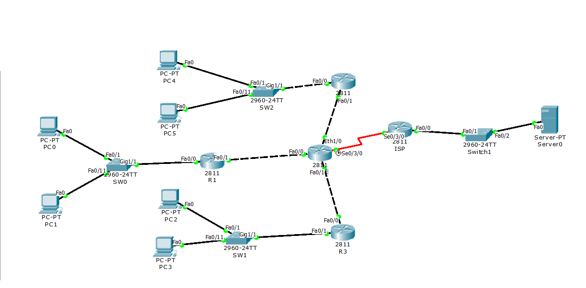

**LAB TỔNG HỢP 3 ĐƯỜNG IPV4**

**1. Set Ip cho 2 PC và Server:**

|PC0|PC5|
| :-: | :-: |
|IP Address: 192.168.1.10|IP Address: 192.168.6.10|
|Subnet Mask:255.255.255.0|Subnet Mask:255.255.255.0|
|Default Getway:192.168.1.1|Default Getway:192.168.6.1|
|DNS Server: 8.8.8.8|DNS Server: 8.8.8.8|
|PC1|Server IP|
|IP Address: 192.168.2.10|IP Address: 8.8.8.8|
|Subnet Mask:255.255.255.0|Subnet Mask:255.255.255.0|
|Default Getway:192.168.2.1|Default Getway:8.8.8.1|
|PC2|DNS Server: 8.8.8.8|
|IP Address: 192.168.3.10|Chỉnh DNS On|
|Subnet Mask:255.255.255.0|Name: google.com|
|Default Getway:192.168.3.1||
|PC3||
|IP Address: 192.168.4.10||
|Subnet Mask:255.255.255.0||
|Default Getway:192.168.4.1||
|PC4||
|IP Address: 192.168.5.10||
|Subnet Mask:255.255.255.0||
|Default Getway:192.168.5.1||
**2,Set SW0:**

**a. Cấu hình cơ bản Switch**

Switch>enable

Switch#configure terminal

Switch(config)#hostname SW0

SW0(config)#line console 0

SW0(config-line)#password cisco

SW0(config-line)#login

SW0(config-line)#exit

SW0(config)#line vty 0 4

SW0(config-line)#password cisco

SW0(config-line)#login

SW0(config-line)#exit

SW0(config)#ban motd "XINCHAO"

SW0(config)#enable secret cisco

**b. Cấu hình VLAN**

SW0(config)#vlan 10

SW0(config-vlan)#name IT

SW0(config-vlan)#Vlan 20

SW0(config-vlan)#name Sale

SW0(config-vlan)#exit

SW0(config)#interface range f0/1-10

SW0(config-if-range)#switchport access vlan 10

SW0(config-if-range)#exit

SW0(config)#interface range f0/11-20

SW0(config-if-range)#switchport access vlan 20

SW0(config-if-range)#exit

SW0(config)#int g1/1

SW0(config-if)#switchport mode trunk 

SW0(config-if)#end

SW0#wr (lưu lại cấu hình)

**3.Set router R1(Chưa cần đưa cổng WIC-2T)**

**a. cấu hình cơ bản**

Router>enable

Router#configure terminal 

Router(config)#hostname R1

R1(config)#line console 0

R1(config-line)#password cisco

R1(config-line)#login

R1(config-line)#exit

R1(config)#line vty 0 4

R1(config-line)#password cisco

R1(config-line)#login

R1(config-line)#exit

R1(config)#banner motd "XINCHAO"

R1(config)#enable secret cisco

**b. Cấu hình Sub interface (nhiều IP gateway trên một cổng)**

R1(config)#int f0/0

R1(config-if)#no shutdown 

R1(config-if)#exit

R1(config)#interface f0/0.10

R1(config-subif)#encapsulation dot1Q 10

R1(config-subif)#ip address 192.168.1.1 255.255.255.0

R1(config-subif)#exit

R1(config)#interface f0/0.20

R1(config-subif)#encapsulation dot1Q 20

R1(config-subif)#ip address 192.168.2.1 255.255.255.0

R1(config-subif)#exit

**c. Cấu hình IP cho cổng bên ngoài**

R1(config)#interface f0/1

R1(config-if)#ip address 10.0.0.1 255.255.255.0

R1(config-if)#no shut

R1(config-if)#exit

**d. Cấu hình định tuyến động (RIPv2)**

R1(config)#router rip 

R1(config-router)#version 2

R1(config-router)#network 10.0.0.0

R1(config-router)#no auto-summary 

R1(config-router)#redistribute connected metric 1

R1(config-router)#end

R1#wr

**4.Cấu hình Router CORE(tắt công tắc đưa cổng NM-4E  vào sau đó bật công tắc lên)**

**a. cấu hình cơ bản**

Router>enable

Router(config)#hostname CORE

CORE(config)#line console 0

CORE(config-line)#password cisco

CORE(config-line)#login

CORE(config-line)#exit

CORE(config)#line vty 0 4

CORE(config-line)#password cisco

CORE(config-line)#login

CORE(config-line)#exit

CORE(config)#banner motd "XIN CHAO"

CORE(config)#enable secret cisco

**b. cấu hình IP cho các cổng và bật NAT trong cổng**

CORE(config)#int f0/0

CORE(config-if)#no shutdown 

CORE(config-if)#ip address 10.0.0.2 255.255.255.0

CORE(config-if)#ip nat inside

CORE(config-if)#exit

CORE(config)#interface s0/3/0

CORE(config-if)#no shutdown 

CORE(config-if)#ip address 200.0.0.100 255.255.255.0

CORE(config-if)#clock rate 64000

CORE(config-if)#ip nat outside 

CORE(config-if)#exit

CORE(config)#int e1/0

CORE(config-if)#ip add 12.0.0.2 255.255.255.0

CORE(config-if)#no shut

CORE(config-if)#ip nat inside 

CORE(config-if)#exit

CORE(config)#int f0/1

CORE(config-if)#no shutdown 

CORE(config-if)#ip nat inside 

CORE(config-if)#ip add 11.0.0.2 255.255.255.0

CORE(config-if)#exit

**c. Cấu hình đường định tuyến mặc định (Default Root)**

CORE(config)#ip route 0.0.0.0 0.0.0.0 s0/3/0

**d. Cấu hình định tuyến động (sử dụng RIPv2)**

CORE(config)#router rip 

CORE(config-router)#version 2

CORE(config-router)#network 10.0.0.0

CORE(config-router)#no auto-summary 

CORE(config-router)#default-information originate 

CORE(config-router)#exit

**e. Cấu hình Access list và NAT,**

CORE(config)#access-list 10 permit any

CORE(config)#ip nat inside source list 10 interface s0/3/0 overload

**f. Cấu hình định tuyến EIGRP**

CORE(config)#router eigrp 10

CORE(config-router)#network 11.0.0.0 0.0.0.255

CORE(config-router)#redistribute static 

CORE(config-router)#exit

**g. Cấu hình định tuyến OSPF**

CORE(config)#router ospf 5

CORE(config-router)#net 12.0.0.0 0.0.0.255 area 0

CORE(config-router)#default-information originate 

CORE(config-router)#exit

CORE(config-router)#end

CORE#wr

**5.Set router ISP(tắt công tắc đưa cổng WIC-2T vào sau đó bật công tắc lên)**

**a. cấu hình cơ bản**

Router>enable

Router#configure terminal 

Router(config)#hostname ISP

ISP(config)#line console 0

ISP(config-line)#password cisco

ISP(config-line)#login

ISP(config-line)#exit

ISP(config)#line vty 0 4

ISP(config-line)#password cisco

ISP(config-line)#login

ISP(config-line)#exit

ISP(config)#banner motd "XIN CHAO"

ISP(config)#enable secret cisco

**b. đặt IP cho các cổng**

ISP(config)#interface f0/0

ISP(config-if)#ip address 8.8.8.1 255.255.255.0

ISP(config-if)#no shutdown 

ISP(config-if)#exit

ISP(config)#interface s0/3/0

ISP(config-if)#no shutdown 

ISP(config-if)#ip address 200.0.0.1 255.255.255.0

ISP(config-if)#end

ISP#wr

**6. Cấu hình SW1**

Switch>en

Switch#conf t

Switch(config)#hostname SW1

SW1(config)#line console 0

SW1(config-line)#password cisco

SW1(config-line)#login

SW1(config-line)#exit

SW1(config)#line vty 0 4

SW1(config-line)#password cisco

SW1(config-line)#login

SW1(config-line)#exit

SW1(config)#banner motd "xin chao"

SW1(config)#enable secret cisco

SW1(config)#vlan 30

SW1(config-vlan)#name bai

SW1(config-vlan)#vlan 40

SW1(config-vlan)#name tap

SW1(config-vlan)#exit

SW1(config)#interface range f0/1-10

SW1(config-if-range)#switchport access vlan 30

SW1(config-if-range)#exit

SW1(config)#interface range f0/11-20

SW1(config-if-range)#switchport access vlan 40

SW1(config-if-range)#exit

SW1(config)#int g1/1

SW1(config-if)#switchport mode trunk 

SW1(config-if)#end

SW1#wr

**7 Cấu hình R3**

Router>enable 

Router#conf terminal 

Router(config)#hostname

Router(config)#hostname R3

R3(config)#int f0/0

R3(config-if)#ip add 11.0.0.1 255.255.255.0

R3(config-if)#no shutdown 

R3(config-if)#exit

R3(config)#interface f0/1.30

R3(config-subif)#encapsulation dot1Q 30

R3(config-subif)#ip address 192.168.3.1 255.255.255.0

R3(config-subif)#exit

R3(config)#interface f0/1.40

R3(config-subif)#encapsulation dot1Q 40

R3(config-subif)#ip add 192.168.4.1 255.255.255.0

R3(config-subif)#exit

R3(config)#interface f0/1

R3(config-if)#no shutdown 

R3(config-if)#exit

R3(config)#router eigrp 10

R3(config-router)#network 11.0.0.0 0.0.0.255

R3(config-router)#redistribute connected 

R3(config-router)#end

R3#wr

**8 Cấu hình SW2**

Switch>en

Switch>enable 

Switch#conf t

Switch(config)#hostname SW2

SW2(config)#line console 0

SW2(config-line)#passwordcisco

SW2(config-line)#login

SW2(config-line)#exit

SW2(config)#line vty 0 4

SW2(config-line)#passwordcisco

SW2(config-line)#login

SW2(config-line)#exit

SW2(config)#banner mot

SW2(config)#banner motd "xin chao"

SW2(config)#enable secret cisco

SW2(config)#vlan 50

SW2(config-vlan)#name kiem

SW2(config-vlan)#vlan 60

SW2(config-vlan)#name tra

SW2(config-vlan)#exit

SW2(config)#interface range f0/1-10

SW2(config-if-range)#switchport acc vlan 50

SW2(config-if-range)#exit

SW2(config)#interface range f0/11-20

SW2(config-if-range)#switchport access vlan 60

SW2(config-if-range)#exit

SW2(config)#int g1/1

SW2(config-if)#switchport mode trunk

SW2(config-if)#end

SW2#wr

**10. Cấu hình R2**

Switch>enable 

Switch#conf t

Switch(config)#hostname R2

R2(config)#line con 0

R2(config-line)# passwordcisco

R2(config-line)#login

R2(config-line)#exit

R2(config)#line vty 0 4

R2(config-line)# passwordcisco

R2(config-line)#login

R2(config-line)#exit

R2(config)#banner mot

R2(config)#banner motd "thuong thoi"

R2(config)#enable secret cisco

R2(config)#int f0/0

R2(config-if)#no shutdown 

R2(config-if)#exit

R2(config)#interface f0/0.50

R2(config-subif)#encapsulation dot1Q 50

R2(config-subif)#ip add 192.168.5.1 255.255.255.0

R2(config-subif)#exit

R2(config)#interface f0/0.60

R2(config-subif)#encapsulation dot1Q 60

R2(config-subif)#ip add 192.168.6.1 255.255.255.0

R2(config-subif)#exit

R2(config)#interface f0/1

R2(config-if)#ip add 12.0.0.1 255.255.255.0

R2(config-if)#no shutdown 

R2(config-if)#exit

R2(config)#router ospf 5

R2(config-router)#network 12.0.0.0 0.0.0.255 area 0

R2(config-router)#redistribute connected subnets 

R2(config-router)#end

R2#wr
