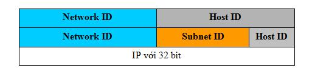

**Giới thiệu về Subnetting IP Networks**

**I. Nội dung chính**

\1. Giới thiệu về chia mạng con

\2. Các bước chia mạng con

**II. Nội dung chi tiết**

**1. Giới thiệu về chia mạng con**

**a. giới thiệu**

\- Như chúng ta đã thấy trong một mạng của lớp A có tới 16.777.214 host vậy việc quản lý và phân chia địa chỉ cho các host sẽ vô cùng khó khăn để giải quyết vấn đề này người quản trị có thể tiến hành phân chia mạng của họ thành nhiều mạng nhỏ hơn các mạng nhỏ hơn này được gọi là các mạng con (Subneting), có thể gọi ngắn gọn là Subnet. Việc phân chia một mạng thành các Subnet còn giúp giảm kích thước của miền quảng bá, khi miền quảng bá quá rộng sẽ dẫn tới việc lãng phí dải thông làm cho hiệu xuất của mạng bị giảm.

\- Để tạo ra một mạng con người quản trị mạng sẽ tiến hành mượn các bit cao nhất trong phần bit dành cho Host ID và gán chúng như là Subnet ID.

**b. Lợi ích của phân chia mạng thành mạng con**

\- Ngoài việc thêm các địa chỉ mạng, phân chia thành mạng con còn có những lợi ích dưới đây:

\- Giảm nghẽn mạng bằng cách tái định hướng các giao vận và giới hạn phạm vi của các thông điệp quảng bá.

\- Giới hạn trong phạm vi từng mạng con các trục trặc có thể xảy ra (không ảnh hưởng tới toàn mạng LAN)

\- Giảm % thời gian sử dụng CPU do giảm lưu lượng của các giao vận quảng bá - Tăng cường bảo mật (các chính sách bảo mật có thể áp dụng cho từng mạng con)

\- Cho phép áp dụng các cấu hình khác nhau trên từng mạng con

**2. Các bước chia mạng con**

**Câu 1.** Đại Nam có 3 phòng máy, phòng 1 có 70 máy, phòng 2 có 140 máy, phòng 3 có 302 máy. Sử dụng dải địa chỉ 10.21.1.0/21 để chia mạng con và gán đường mạng con sau chia phù hợp với 3 phòng máy.

**Câu 2.** Từ đường mạng con gán cho phòng máy 1, yêu cầu tìm các thông số sau:

a. Network ID

b. Host ID

c. Địa chỉ đường mạng

d. Địa chỉ Broadcast

e. Dải địa chỉ cấp phát

f. Subnet mask

g. Default gateway

**Lời giải:** 

Ý 1. 

B1.  Tìm số Bit của Host ID mà các phòng máy cần sử dụng

\- Phòng máy 1 có 70 máy nên số Bit Host sử dụng là 7 bit (27-2 <=>128-2=126).

\- Phòng máy 2 có 140 máy nên số Bit Host sử dụng là 8 bit (28-2<=>256-2=254).

\- Phòng máy 3 có 302 máy nên số Bit Host sử dụng  là 9 bit (29-2<=>512-2=510)

B2. Do đường mạng 10.21.1.0/21 chưa phải đường mạng chuẩn nên ta cần đưa về đường chuẩn bằng phép and:

00001010.00010101.00000001.00000000

11111111.11111111.11111000.00000000

00001010.00010101.00000000.00000000

=> Đường mạng chuẩn sẽ là: 10.21.0.0/21

B3. Sử dụng phương pháp tối ưu VLSM để chia đường mạng chuẩn 10.21.0.0/21 thành các mạng con:

\- Từ Phòng máy 3, số Bit Host sử dụng là 9 nên số Bit còn dư là: 32-21-9=2 bit. Sử dụng 2 bit dư này để chia mạng con ta sẽ có 22=4 đường mạng con (các giá trị là: 00, 01,10,11).

00001010.00010101.00000000.00000000

11111111.11111111.11111000.00000000

=> Đường mạng con 1 là: 10.21.0.0/23

=> Đường mạng con 2 là: 10.21.2.0/23

=> Đường mạng con 3 là: 10.21.4.0/23

=> Đường mạng con 4 là: 10.21.6.0/23

\- Lấy đường mạng con 1 là: 10.21.0.0/23 gán cho Phòng máy 3.

\- Lấy đường mạng con 2 là: 10.21.2.0/23 đem chia tiếp.

B4. Tiếp tục sử dụng phương pháp tối ưu VLSM để chia đường mạng 10.21.2.0/23 thành các mạng con:

\- Từ Phòng máy 2, số Bit Host sử dụng là 8 nên số Bit còn dư là: 32-23-8=1 bit. Sử dụng 1 bit dư này để chia mạng con ta sẽ có 21=2 đường mạng con (các giá trị là: 0,1).

00001010.00010101.00000010.00000000

11111111.11111111.11111110.00000000

=> Đường mạng con 1 là: 10.21.2.0/24

=> Đường mạng con 2 là: 10.21.3.0/24

\- Lấy đường mạng con 1 là: 10.21.2.0/24 gán cho Phòng máy 2.

\- Lấy đường mạng con 2 là: 10.21.3.0/24 đem chia tiếp.

B5. Tiếp tục sử dụng phương pháp tối ưu VLSM để chia đường mạng 10.21.3.0/24 thành các mạng con:

\- Từ Phòng máy 1, số Bit Host sử dụng là 7 nên số Bit còn dư là: 32-24-7=1 bit. Sử dụng 1 bit dư này để chia mạng con ta sẽ có 21=2 đường mạng con (các giá trị là: 0,1).

00001010.00010100.00000011.00000000

11111111.11111111.11111111.00000000

=> Đường mạng con 1 là: 10.21.3.0/25

=> Đường mạng con 2 là: 10.20.3.128/25

\- Lấy đường mạng con 1 là: 10.21.3.0/25 gán cho Phòng máy 1.

Kết luận: 

Ta có các đường mạng con gán cho các Phòng máy là: 

\- 10.21.3.0/25 gán cho Phòng máy 1

\- 10.21.2.0/24 gán cho Phòng máy 2

\- 10.21.0.0/23 gán cho Phòng máy 3

Và các đường còn dư là: 

\- 10.21.4.0/23

\- 10.21.6.0/23

\- 10.21.3.128/25

