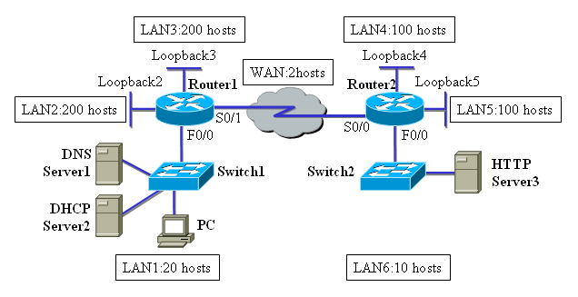

Giảng viên: Lê Ngọc An
## **Network Diagram, major IP address = 155.55.0.0/16**

Given the network as in the diagram above, you are to perform the tasks:

**Section 1**: **Using VLSM to create the** **IP planning**

**page  PAGE 2 of  NUMPAGES 2**

1. LAN1: 20 host addresses
1. LAN2: 200 host addresses
1. LAN3: 200 host addresses
1. LAN4: 100 host addresses
1. LAN5: 100 host addresses
1. LAN6: 10 host addresses
1. WAN link: 2 host addresses

**1.1: IP subnetting table**

|**Name-required  addresses**|**Subnet address**|**Address range**|**Broadcast address**|**Network/Prefix**|
| :-: | :-: | :-: | :-: | :-: |
|**LAN1**|||||
|**LAN2**|||||
|**LAN3**|||||
|**LAN4**|||||
|**LAN5**|||||
|**LAN6**|||||
|**WAN link**|||||

`	`**1.2: IP Address assignments**

||**IP address**|**Default gateway**|**Network number**|
| :-: | :-: | :-: | :-: |
|**Router1, S0/1**||Unwanted||
|**Router1, F0/0**||Unwanted||
|**Router1, Loopback2**||Unwanted||
|**Router1, Loopback3**||Unwanted||
|**Router2, S0/0**||Unwanted||
|**Router2, F0/0**||Unwanted||
|**Router2, Loopback4**||Unwanted||
|**Router2, Loopback5**||Unwanted||
|**DNS Server1**||||
|**DHCP Server2**||||
|**PC1**|Dynamic|Dynamic||
|**HTTP Server3**||||

**2. Basic configuration for Router, switch, PC using Packet Tracer.**
