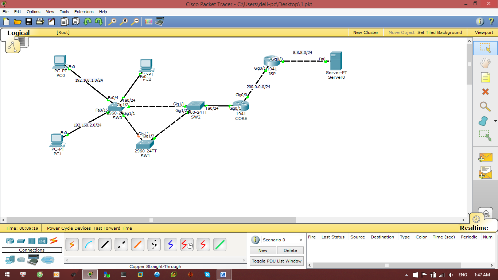
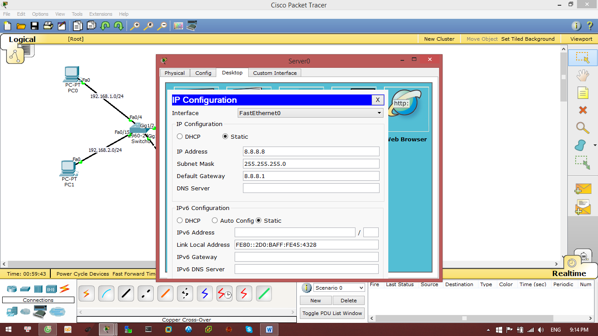
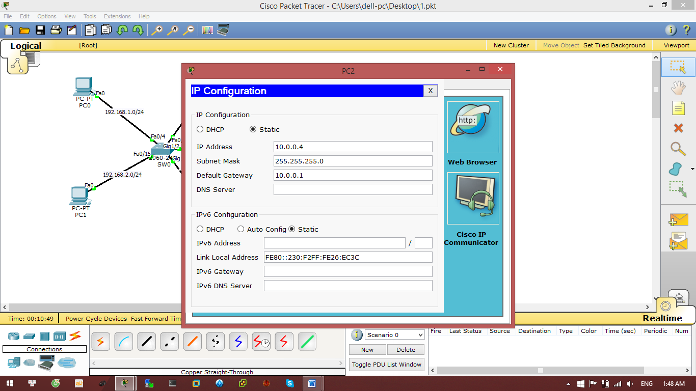
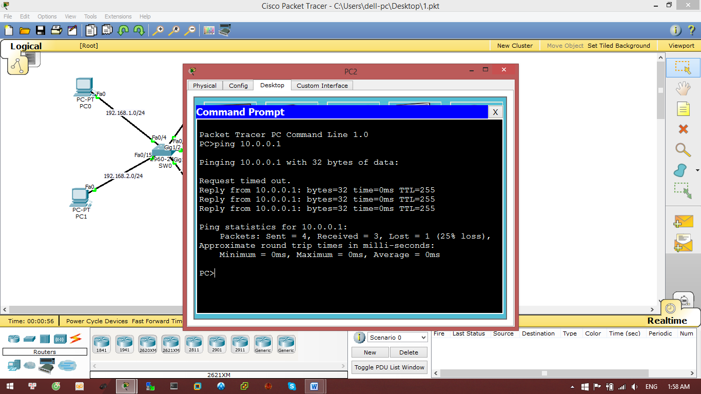
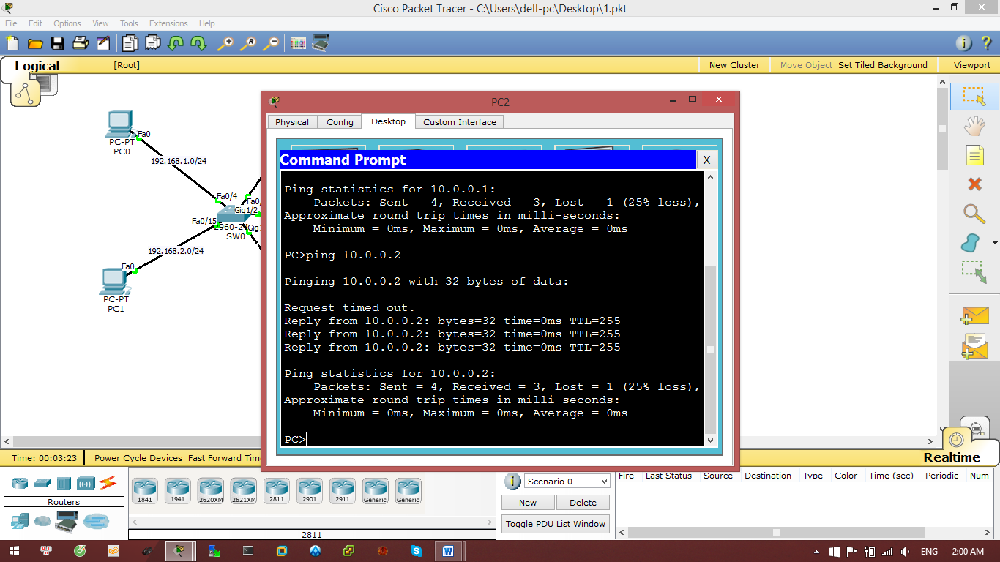
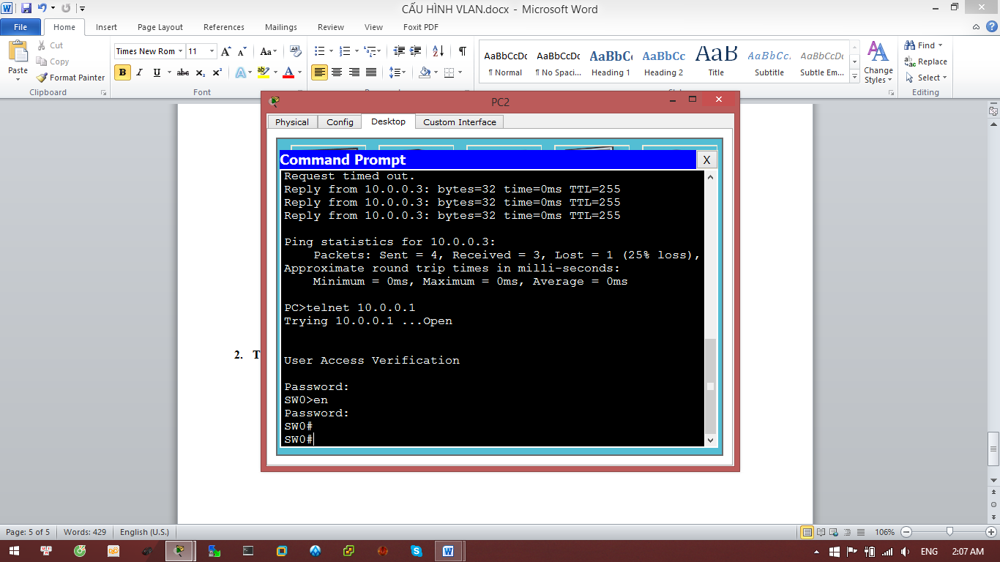

**CẤU HÌNH VLAN**

**I. Yêu cầu chuẩn bị**

**1. Thiết bị gồm**

\- 2 PC

\- 3 Switch - 2960

\- 2 router - 1941

\- 1 server

**2. Sơ đồ hình**

**II. Cấu hình các thiết bị**

**1. Đặt IP cho PC và server**

|PC0|PC1|Server|
| :-: | :-: | :-: |
|

|

|

|
|PC2|
||

**2. Cấu hình từng thiết bị**

1. **Switch 0**

Switch>enable

Switch#configure terminal 

Switch(config)#hostname SW0

SW0(config)#enable secret dainam

SW0(config)#line console 0

SW0(config-line)#password dainam

SW0(config-line)#login 

SW0(config-line)#exit

SW0(config)#line vty 0 4

SW0(config-line)#password dainam

SW0(config-line)#login 

SW0(config-line)#exit

SW0(config)#banner motd "XIN CHAO"

SW0(config)#vlan 10

SW0(config-vlan)#name IT

SW0(config-vlan)#vlan 20

SW0(config-vlan)#name sale

SW0(config-vlan)#exit

SW0(config)#interface range f0/1-10

SW0(config-if-range)#switchport access vlan 10

SW0(config-if-range)#exit

SW0(config)#interface range f0/11-20

SW0(config-if-range)#switchport access vlan 20

SW0(config-if-range)#exit

SW0(config)#interface range g1/1-2

SW0(config-if-range)#switchport mode trunk

SW0(config)#interface vlan 1

SW0(config)#no shutdown

SW0(config-if)#ip add 10.0.0.101 255.255.255.0

SW0(config-if)#end

SW0#write

1. **Switch 1**

Switch>enable

Switch#configure terminal 

Switch(config)#hostname SW1

SW1(config)#enable secret dainam

SW1(config)#line vty 0 4

SW1(config-line)#password dainam

SW1(config-line)#login 

SW1(config-line)#exit

SW1(config)#line console 0

SW1(config-line)#password dainam

SW1(config-line)#login 

SW1(config-line)#exit

SW1(config)#banner motd "XIN CHAO"

SW1(config)#vlan 10

SW1(config-vlan)#name IT

SW1(config-vlan)#vlan 20

SW1(config-vlan)#name sale

SW1(config-vlan)#exit

SW1(config)#interface range g1/1-2

SW1(config-if-range)#switchport mode trunk

SW1(config)#interface vlan 1

SW1(config)#no shutdown

SW1(config-if)#ip add 10.0.0.102 255.255.255.0

SW1(config-if)#end

SW1#write

1. **Switch 2**

Switch>enable

Switch#configure terminal 

Switch(config)#hostname SW2

SW2(config)#enable secret dainam

SW2(config)#line console 0

SW2(config-line)#password dainam

SW2(config-line)#login 

SW2(config-line)#exit

SW2(config)#line vty 0 4

SW2(config-line)#password dainam

SW2(config-line)#login 

SW2(config-line)#exit

SW2(config)#banner motd "XIN CHAO"

SW2(config)#vlan 10

SW2(config-vlan)#name IT

SW2(config-vlan)#vlan 20

SW2(config-vlan)#name sale

SW2(config-vlan)#exit

SW2(config)#interface range g1/1-2

SW2(config-if-range)#switchport mode trunk

SW2(config)#interface f0/24

SW2(config-if-range)#switchport mode trunk

SW2(config)#interface vlan 1

SW2(config)#no shutdown

SW2(config-if)#ip add 10.0.0.103 255.255.255.0

SW2(config-if)#end

SW2#write

1. **Router CORE**

Router>enable

Router(config)#hostname CORE

CORE(config)#line console 0

CORE(config-line)#password dainam

CORE(config-line)#login

CORE(config-line)#exit

CORE(config)#line vty 0 4

CORE(config-line)#password dainam

CORE(config-line)#login

CORE(config-line)#exit

CORE(config)#banner motd "XIN CHAO"

CORE(config)#enable secret dainam

CORE(config)#int g0/1

CORE(config-if)#no shutdown 

CORE(config-if)#exit

CORE (config)#interface g0/1.10

CORE (config-subif)#encapsulation dot1Q 10

CORE (config-subif)#ip address 192.168.1.1 255.255.255.0

CORE (config-subif)#ip nat inside

CORE (config-subif)#exit

CORE (config)#interface g0/1.20

CORE (config-subif)#encapsulation dot1Q 20

CORE(config-subif)#ip address 192.168.2.1 255.255.255.0

CORE (config-subif)#ip nat inside

CORE(config-subif)#exit

CORE (config)#interface g0/1.1

CORE (config-subif)#encapsulation dot1Q 1

CORE(config-subif)#ip address 10.0.0.1 255.255.255.0

CORE (config-subif)#ip nat inside

CORE(config-subif)#exit

CORE(config)#interface g0/0

CORE(config-if)#no shutdown 

CORE(config-if)#ip address 200.0.0.100 255.255.255.0

CORE(config-if)#ip nat outside 

CORE(config-if)#exit

CORE(config)#ip route 0.0.0.0 0.0.0.0 200.0.0.1

CORE(config)#access-list 10 permit any

CORE(config)#ip nat inside source list 10 interface g0/0 overload

CORE(config-if)#end

CORE#write

1. **Router ISP**

Router>enable

Router#configure terminal 

Router(config)#hostname ISP

ISP(config)#line console 0

ISP(config-line)#password dainam

ISP(config-line)#login

ISP(config-line)#exit

ISP(config)#line vty 0 4

ISP(config-line)#password dainam

ISP(config-line)#login

ISP(config-line)#exit

ISP(config)#banner motd "XIN CHAO"

ISP(config)#enable secret dainam

ISP(config)#interface g0/0

ISP(config-if)#ip address 8.8.8.1 255.255.255.0

ISP(config-if)#no shutdown 

ISP(config-if)#exit

ISP(config)#interface g0/1

ISP(config-if)#no shutdown 

ISP(config-if)#ip address 200.0.0.1 255.255.255.0

ISP(config-if)#end

ISP#wr

**III. Sử dụng telnet tại PC3**

**1. Ping kiểm tra tới các Switch**

|SW0||
| :-: | :-: |
|SW1||
|SW2||
**2. Telnet đến các Switch:**

