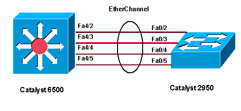

**Công nghệ Ethernet channel**

**Nội dung chính:**

1. Công nghệ Ethernetchannel là gì?
1. Lợi ịch và hạn chế của Ethernet channel.
1. Giao thức PAgP và LACP

**Nội dung chi tiết**

1. Công nghệ Ethernet channel là gì?

Switch có thể sử dụng các cổng Ethernet, Fast-Ethernet(FE), GigaEthernet(GE), 10 GigaEthernet(10GE) để tăng tốc độ các link. Mỗi lần link bị quá tải ta có thể nâng cấp các đường lên 10 lần, nhưng như vậy sẽ rất tốn kém trong việc mua module gắn vào và dây dẫn, bên cạnh đó, không phải switch nào cũng có module để bạn gắn cũng như tốn chi phí về mua dây dẫn. Ví dụ bạn đang dùng 1 link FE, giờ quá tải, bạn tăng lên GE, hiệu quả sử dụng rất thấp và không cần thiết.

Một phương pháp khác phù hợp hơn trong trường hợp này để tăng băng thông các link đó là kếp hợp (“bó”) các link lại. Công nghệ này được gọi là EtherChannel.

Công nghệ EtherChannel có thể bó từ 2 đến 8 link FE, GE, 10GE thành 1 link logical. Khi đó, switch đối xử các port thuộc EtherChannel như 1 port duy nhất.

Switch hoặc thiết bị ở 2 đầu EtherChannel phải hiểu và sử dụng công nghệ EtherChannel để đảm bảo hoạt động đúng và chống loop. Nếu chỉ có 1 đầu sử dụng EtherChannel, còn đầu bên kia không sử dụng thì có thể gây ra loop.

Traffic không phải lúc nào cũng được phân bố đồng đều qua các đường link thuộc EtherChannel, mà nó phụ thuộc vào phương pháp load balancing mà switch sử dụng và mẫu traffic trong mạng.

Nếu một trong các link thuộc EtherChannel bị down thì traffic sẽ tự động được chuyển sang link khác trong channel chỉ trong vòng vài miliseconds (theo kết quả mình test trên thiết bị thật thì thậm chí không bị rớt 1 gói tin nào). Khi link up trở lại thì traffic được phân bố lại như cũ.

1. **Lợi ịch và hạn chế của Ethernet channel.**

2.1 Lợi ích của EtherChannel

- Hầu hết các cấu hình được thực trên cấu hình EtherChannel đảm bảo tính nhất quán trong suốt liên kết.
- Dựa trên các cổng Switch có sẵn – không cần nâng cấp.
- Cân bằng tải giữa các liên kết trên cùng một EtherChannnel.
- Tạo ra một tập hợp được xem như là một liên kết logic bởi STP.
- Cung cấp khả năng dự phòng bởi vì liên kết tổng thể được xem như là 1 kết nối logic. Nếu 1 liên kết vật lý trong kênh hỏng, điều này không gây ra sự thay đổi trong cấu trúc liên kết và không đòi hỏi tính toán lại STP.

2.2 Sư hạn chế hoạt động

- EtherChannel được thực hiện bởi  việc nhóm nhiều cổng vật lý thành một hoặc nhiều liên kết logic EtherChannel.
- Các giao diện không thể kết hợp với nhau.
- EtherChannel cung cấp băng thông song song (full-duplex) lên đến  800 Mb/s (Fast EtherChannel) hoặc 8 Gb/s (Gigabit EtherChannel).  
- EtherChannel có thể gộp lên đến 16 cổng Ethernet được cấu hình tương thích.
- Switch Cisco IOS hiện tại hỗ trợ tới sáu EtherChannels.

1. **Các giao thức bắt tay của EtherChannel**

   Có hai giao thức được dùng để hình thành nên EtherChannel PagP và LACP.** 

   3.1 PagP**

   Các gói tin Pagp được trao đổi giữa các switch trên các port EtherChannel. Các thông số của switch láng giềng được xác định (như khả năng của port) và sẽ được so sánh với switch cục bộ. Các port có cùng neighbor ID và khả năng hình thành nhóm sẽ được nhóm lại với nhau thành các kết nối FEC. 

   PagP hình thành nên EtherChannel chỉ trên những port được cấu hình cùng static VLAN hoặc là cùng loại trunking. Pagp cũng thay đổi các thông số động của EtherChannel nếu một trong những port của bundle bị thay đổi. Ví dụ nếu thông số VLAN, speed, tốc độ duplex của một port trong một EtherChannel bị thay đổi, Pagp sẽ thay đôi các thông số đó trong tất cả các port còn lại. Pagp có thể được cấu hình ở chế độ active (desirable) trong đó một switch chủ động yêu cầu switch đầu xa hình thành nên EtherChannel. Khi switch hoạt động trong chế độ passive của PAGP, switch sẽ chỉ bắt tay nếu switch đầu xa yêu cầu nó. 

   3.2 LACP

   LACP cũng gửi các gói trên các port EtherChannel của switch. Tuy nhiên LACP cũng gán vai trò port đến các đầu cuối của EtherChannel. 

   Các switch có độ ưu tiên thấp nhất sẽ được phép ra quuyết định về các port nào sẽ được tham gia vào EtherChannel ở một thời điểm. Các port được chọn lựa và trở thành active theo giá trị độ ưu tiên priority của nó, trong đó giá trị ưu tiên thấp sẽ có mức ưu tiên cao. 

   Một tập hợp 16 kết nối tiềm năg có thể được chỉ ra cho một EtherChannel. Thông qua LACP, một switch sẽ chọn lựa ra 8 port có độ ưu tiên thấp nhất như là các member active của EtherChannel. Các port còn lại sẽ nằm trong trạng thái standby và sẽ được enable nếu một trong những kết nối active bị down. Cũng giống như PaGP, LACP có thể được cấu hình trong mode active, trong đó một switch sẽ chủ động hỏi switch đằng xa bắt tay hình thành EtherChannel. Chế độ passive thì switch chỉ chủ động hình thành EtherChannel chỉ nếu switch đầu xa khởi tạo nó. 
