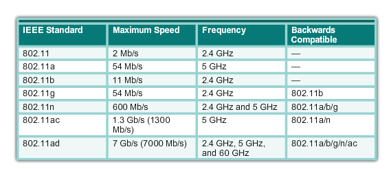
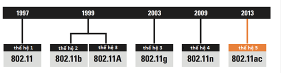
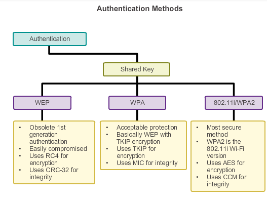

**Công nghệ mạng không dây**

**I. Nội dung chính**

\1. Tìm hiểu mạng không dây

1. ` `Khái niệm

1.2. Phân loại mạng không dây

1.3. ví dụ về mạng không dây

\2. Tiêu chuẩn 802.11

\3. bảo mật mạng không dây

**II. Nội dung chi tiết**

**1. Tìm hiểu về mạng không dây**

**1.1. Khái niệm**

\- Mạng không dây là mạng sử dụng công nghệ cho phép hai hay hay nhiều thiết bị kết nối với nhau bằng sóng.

\- Mạng không dây sử dụng sóng radio hay sóng cực ngắn để duy trì các kênh truyền thông giữa các thiết bị truyền thông với nhau.

\- Ưu và nhược điểm của mạng không dây.

\+ Ưu điểm :của mạng không dây đó là tính di động và loại bỏ được sự rườm rà của việc đi cáp.

\+ Nhược điểm: của mạng không dây có thể nói đến là khả năng nhiễu sóng radio do thời tiết,do các thiết bị không dây khác hay các vật chắn (như các nhà cao tầng, địa hình đồi núi,…)

\- Mạng không dây nhanh chóngtrở nên phổ biến đối với cả mạng gia đình và mạng cho mục đích thương mại.

**1.2 Phân loại**

\- Mạng wireless được chia thành 4 nhóm :Wireless wide-area network (WWAN), Wireless local-area network (WLAN), Wireless person area network (WPAN), Wireless metropolitan area network (WMAN).

\+ WLAN là mạng cục bộ (local area network –LAN) : nổi bật là công nghệ wifi với nhiều chuẩn mở rộng khác nhau thuộc gia đình 802.11 (a,b,g,n...). với tốc độ truyền 54+Mbps, tầm phủ song trung bình.Ứng dụng trong mạng enterprise networks. Các hệ thống mạng cục bộ thường có băng thông lớn, tốc độ truyền dữ liệu nhanh và chi phí triển khai thấp. được triển khai trong phạm vi  hẹp, ví dụ như trong phạm ci bán kính 500m, thường được sử dụng trong nội bộ công ty, doanh nghiệp , trường học hay một phòng thí nghiệm….

\+ WWAN là mạng diện rộng (Wide area network-WAN): hay còn gọi là mạng tế bào. Sử dụng các công nghệ như GSM, GPRS,UMTS,CDMA2000… tốc độ 10-384Mbps, tầm phủ song xa. ứng dụng trong PDAs, Mobile phone, cellular. Hệ thống triển khai trên phạm vi rộng. ví dụ như giữa các thành phố, các tiểu bang, hay giữa các quốc gia trong khu vực, hoặc toàn thế giới.

\+ WMAN là mạng trung tâm (Metropolitan area network) : sử dụng chuẩn 802.11 MMDS, LMDS. Tốc độ truyền +22Mbps, tầm phủ song khá xa. ứng dụng trong Fixed, Last mile access, thường được triển khai trong phạm vi rộng hơn mạng cục bộ. Ví dụ trong một thành phố, giữa các trường đại học, giữa các Viện nghiên cứu, hoặc giữa các chi nhánh của một công ty…

\+ WPAN- mạng cá nhân (Wireless personal area network) : là mạng được tạo bởi sự kết nối vô tuyến trong tầm ngắn (khoảng vài mét) giữa các thiết bị ngoại vi như tai nghe, đồng hồ, máy in,bàn phím, chuột, khóa USB … với máy tính cá nhân, điện thoại di động… với tốc độ 1Mbps, tầm phủ song ngắn. Ứng dụng trong peer-to-peer, device-to-device. Sự kết nối vô tuyến trong mạng WPAN có thể dùng các công nghệ như Bluetooth, Wibree, UWB … đây là mô hình mạng phổ biến trong hệ thống mạng không dây.

**1.3 Ví dụ về mạng không dây**

**- Mạng Wlan:** Mạng wlan là một mạng dùng để kết nối hai hay nhiều máy tính với nhau mà không sử dụng dây dẫn. Wlan dùng công nghệ trải phổ, sử dụng sóng vô tuyến cho phép truyền thông giữa các thiết bị trong một vùng nào đó gọi là Basic Service set.

**+ Ưu điểm của mạng Wlan:**

- Sự tiện lợi: mạng không dây cung cấp giải pháp cho phép người sử dụng truy cập tài nguyên trên mạng bất kì nơi đâu trong khu vực wlan được triển khai.
- Khả năng di động: với sự phát triển vô cùng mạnh mẽ của viễn thông di động, người sử dụng có thể truy cập internet ở bất cứ đâu.
- Hiệu quả: người sử dụng có thể duy trì kết nối mạng khi họ đi từ nơi này đến nơi khá
- Triển khai: chúng ta chỉ cần một đường truyền ADSL và một AP là được một mạng Wlan đơn giản.
- Khả năng mở rộng: mở rộng dễ dàng có thể đáp ứng tức thì khi có sự gia tăng lớn về số lượng người truy cập.

**+ Nhược điểm của mạng Wlan:**

- Bảo mật: đây có thể nói là nhược điểm lớn nhât của mạng Wlan, bởi vì phương tiện truyề tín hiệu là song và môi trường truyền tín hiệu là không khí nên khả năng của một mạng không dây bị tấn công là rất lớn.
- Phạm vi: như ta đã biết IEEE 802 11n mới nhất hiện nay cũng chỉ có thể hoạt động ở phạm vi tối đa là 150m, nên mạng không dây chỉ phù hợp cho một không gian hẹp.
- Độ tin cậy: do phương tiện truyền tín hiệu là sóng vô tuyến nên việc bị nhiễu, suy giảm …là điều không thể tránh khỏi. Điều này gây ảnh hưởng lớn đến hiệu quả hoạt động của mạng.
- Tốc độ: tốc độ cao nhất hiện nay của Wlan có thể lên đến 600Mbps nhưng vẫn chậm hơn rất nhiều so với các mạng cáp thông thường.

**- Bluebooth:** Bluetooth là công nghệ sử dụng sóng radio, tần số không đăng ký 2.4Ghz. Có khả năng kết nối cùng lác 7 thiết bị khác nhau. Tuy sử dụng cùng tần số với công nghệ wifi(802.11x) nhưng chúng không hề xung đột với nhau vì BT sử dụng tần số bước nhảy ngắn, thay đổi tần số 1600 lần/ giây. Bluetooth là kết quả của ý tưởng tạo ra 1 công nghệ đủ rẻ, tốn ít năng lượng và dễ dàng giao tiếp với các thiết bị khác nhau. Bluetooth có thể làm được: các thiết bị BT có thể nối kết và chia sẻ dịch vụ với nhau.Các thiết bị có BT hiện nay chủ yếu là điện thoại di động, máy in, tai nghe, máy ảnh số,….

**+ Một số điểm chủ yếu về bluetooth.**

- Thay thế dây nối.
- Khoảng cách ngắn.
- Tốc độ ngắn.
- Giá thành rẻ.
- Tốn ít năng lượng.
- Giới hạn không gây nhiễu.
- An toàn với công nghệ mã hóa trong.

\- Mạng 3G: 3G là công nghệ truyền thông thế hệ thứ ba, cho phép truyền cả dữ diệu thoại và dữ liệu ngoài thoại ( tải dữ liệu, gửi email, tin nhắn nhanh, hình ảnh …)

3G là giai đoạn mới nhất trong sự tiến hóa của viễn thông di động

3G giúp chúng ta thực hiện truyền thông thoại và dữ liệu, download âm thanh và hình ảnh với bảng tần cao. Các ứng dụng 3G thông dụng gồm hội nghị video di động; chụp ảnh, gửi ảnh kỷ thuật số nhờ điện thoại máy ảnh; gửi và nhận mail và fili đính kèm dung lượng lớn; tải tệp tin video và MP3; và nhắn tin với dạng chữ chất lượng cao.

**2. Tiêu chuẩn 802.11**

\- **Chuẩn 802.11**

\+ Năm 1997, IEEE đã giới thiệu chuẩn mạng không dây đầu tiên và đặt tên nó là 802.11. Tuy nhiên chuẩn 802.11 chỉ hỗ trợ tốc độ mạng tối đa 2 Mbps với băng tần 2.4 GHz, rất chậm so với ngày nay và không được áp dụng rộng rãi trên thị trường

\- **Chuẩn 802.11b**

\+ Hai năm sau vào tháng 7 năm 1999, chuẩn 802.11b ra đời và hỗ trợ tốc độ lên đến 11Mpbs thay vì 2Mbps như trước kia. Tương tự thế hệ đầu tiên, chuẩn kết nối 802.11b cũng sử dụng băng tần 2.4 GHz rất dễ bị gây nhiễu từ các thiết bị điện tử khác như điện thoại di động, lò vi sóng,...

**- Chuẩn 802.11a**

\+ Chuẩn 802.11a cũng được phát triển song song với chuẩn 802.11b, tuy nhiên chuẩn a thường được sử dụng trong các mạng của doanh nghiệp thay vì gia đình như chuẩn b vì giá thành khá cao.

\+ So với chuẩn 802.11b, chuẩn này hỗ trợ tốc độ tối đa gần gấp 5 lần, lên đến 54 Mpbs và sử dụng băng tần vô tuyến 5 GHz có thể tránh tình trạng bị nhiễu do các thiết bị khác. Tuy nhiên do tần số cao hơn nên phạm vi hoạt động của chuẩn 802.11a có phần hẹp hơn (40-100m) và khó xuyên qua các vật cản, vách tường.

**- Chuẩn 802.11g**

\+ Năm 2003, chuẩn WiFi thế hệ thứ 3 ra đời được đặt là chuẩn 802.11g, chuẩn WiFi này thậm chí còn được sử dụng ở nhiều mạng WiFi các gia đình hiện nay. Chuẩn 802.11g được xem là kết hợp giữa chuẩn a và b trước kia, với giá thành khá rẻ. 

\+ Chuẩn 802.11g hỗ trợ tốc độ đến 54 Mpbs như chuẩn a nhưng sử dụng băng tần 2.4 GHz như chuẩn b, vì vậy chuẩn này có tốc độ cao, phạm vi tín hiệu tốt (80-200m). Và tất nhiên chuẩn này cũng có nhược điểm như chuẩn b là dễ bị nhiễu từ các thiết bị phát sóng khác. Do sự giống nhau về nhiều thông số, chuẩn kết nối 802.11g có khả năng tương thích ngược với chuẩn 802.11b và ngược lại

**- Chuẩn 802.11n**

\- Đây là chuẩn tương đối mới (mới nhất là chuẩn ac) và đang sử dụng khá phổ biến hiện nay. Chuẩn WiFi 802.11n được đưa ra nhằm cải thiện chuẩn 802.11g bằng cách sử dụng công nghệ MIMO (Multiple-Input Multiple-Output) tận dụng nhiều anten hơn.

\- Chuẩn kết nối 802.11n hỗ trợ tốc độ tối đa lên đến 600 Mpbs, có thể hoạt động trên cả băng tần 2,4 GHz và 5 GHz, nếu router hỗ trợ thì hai băng tần này có thể cùng phát sóng song song. Chuẩn kết nối này đã và đang dần thay thế chuẩn 802.11g với tốc độ cao, phạm vi tín hiệu rất tốt (từ 100-250m) và giá thành đang ngày càng phù hợp với túi tiền người tiêu dùng.

**- Chuẩn 802.11ac**

\+ Chuẩn 802.11ac là chuẩn mới WiFi nhất của IEEE đã được tung ra thị trường, áp dụng công nghệ đa anten đã có trên chuẩn 802.11n, với băng tần 5 GHz và tốc độ tối đa lên đến 1730 Mbps người dùng sẽ trải nghiệm tốc độ mạng ở mức cao nhất. Tuy nhiên giá thành của WiFi chuẩn ac hiện tại còn khá cao so với các chuẩn còn lại nên bạn có thể cân nhắc.

**3. Bảo mật mạng không dây**

**a. tại sao cần bảo mật**

\- Người sử dụng độc hại muốn cố ý can thiệp vào thông tin liên lạc không dây. Hãy vô hiệu hóa mạng không dây, nơi không có thiết bị hợp pháp có thể truy cập mạng.

\- Mạng WLAN hoạt động trong băng tần không có giấy phép và dễ bị can thiệp từ các thiết bị không dây khác

\- Bị tấn công DOS vào frame quản lí

\- Một kẻ tấn công lợi dụng phương pháp cạnh tranhCSMA / CA để độc chiếm băng thông.

\- Những kẻ tấn công làm nghẽn Clear to Send (CTS) frame liên tục đến một STA giả mạo.

\- Kết nối với một mạng công ty mà không có ủy quyền rõ ràng và chống lại chính sách của công ty.

\- Kết nối hoặc kích hoạt bởi một kẻ tấn công để nắm bắt dữ liệu khách hàng, chẳng hạn như các địa chỉ MAC của khách hàng (cả không dây và có dây), hoặc để chụp và các gói dữ liệu ngụy trang, để đạt được quyền truy cập vào tài nguyên mạng, hoặc đểtấn công như người tấn công ở giữa (man-in-the-middle)

\- Để ngăn chặn việc cài đặt các AP giả mạo, các tổ chức phải sử dụng phần mềm theo dõi giám sát điểm truy cập trái phép.

**b. cách bảo mật**

**- Phương pháp mã hóa:** IEEE 802.11 và hiệp hội Wifi chuẩn WPA và WPA2 sử dụng giao thức mã hóa sau:

\+ Temporal Key Integrity Protocol (TKIP) 

=> Sử dụng bởi WPA.

=> Tận dụng nền tảng của WEP, nhưng mã hóa lớp 2 và thực hiện “Kiểm tra tích hợp tin nhắn CISCO” (MIC)

=> Advanced Encryption Standard (AES) 

=> Phương pháp mã hóa được sử dụng bới WPA2: Luôn chọn WPA2 với AES nếu có thể.

**- Xác thực người dùng chính:** WPA và WPA2 hỗ trợ 2 loại xác thực

**+ Cá nhân** 

=> Dùng cho mạng ở nhà và mạng công ty nhỏ, hoặc người dùng đã xác thực sử dụng khóa được chia sẻ trước (PSK)

=> Không yêu cầu xác thực máy chủ

**+ Doanh nghiệp** 

=> Yêu cầu xác thực máy chủ “Dịch vụ Quay số xác thực từ xa” (RADIUS).

=> Cung cấp phương pháp bảo mật bổ sung.

=> Users must authenticate using 802.1X standard, which uses the Extensible Authentication Protocol (EAP) for authentication.

=> Người dùng xác thực sử dụng chuẩn 802.1X, sử dụng “Giao thức xác thực mở rộng” (EAP) để xác thực

**- Xác thực cho doanh nghiệp:** Những sư lựa chọn chế độ bảo mật của doanh nghiệp yêu cầu: Authentication, Authorization, and Accounting (AAA) RADIUS server.
